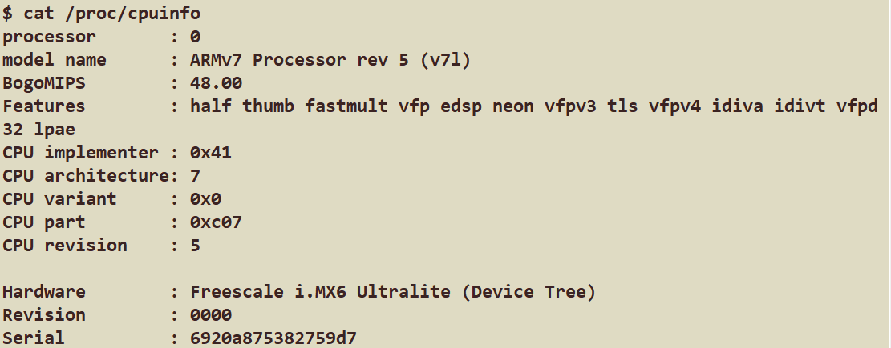

# CFBox

[中文](README.md) | **[English](README.en.md)**

A modern C++23 BusyBox alternative — single binary, 123 applets, 399 tests. Runs as PID 1 on the i.MX6ULL, replacing BusyBox.

<p align="center">
  
</p>

> Above: cfbox booting the imx-forge rootfs as PID 1 — runs `rcS` (mount/mdev), prints `Please press Enter to activate this console.` (askfirst), and drops into a cfbox `sh` after Enter.

[](https://github.com/Awesome-Embedded-Learning-Studio/CFBox/actions/workflows/ci.yml)
[](https://opensource.org/licenses/MIT)
[](https://en.cppreference.com/w/cpp/23)
[](https://cmake.org/)
[](tests/)
[](src/applets/)
[](cmake/toolchain/Toolchain-armhf.cmake)

## Overview

CFBox is a single-executable Unix utility collection distributed via symbolic links. **123 applets** are implemented and tested, with a CI pipeline covering native builds, cross-compilation (armhf/aarch64), and QEMU user/system-mode testing. It supports configurable CMake builds (per-applet toggles), GNU-style long options, and colored help output. The long-term goal is to gradually catch up to — and even surpass — mainstream coreutils.

**Design philosophy:** Simplicity first — Modern C++ (`std::expected`, no exceptions / no RTTI) — Embedded-friendly (cross-compilation, static linking, runs as PID 1 init).

## In Action: i.MX6ULL

cfbox **replaces BusyBox** on the NXP i.MX6ULL (armhf, Cortex-A7), serving as PID 1 + the toolset for the [imx-forge](projects/imx-forge-demo) rootfs and driving the full boot loop:

| Boot stage | Handled by cfbox |
|-----------|------------------|
| PID 1 | `init` — parses BusyBox-format `/etc/inittab`; supports `sysinit`/`askfirst`/`respawn`/`ctrlaltdel`/`shutdown` |
| rcS | `mount -a` / `mount -t devpts devpts /dev/pts` / `mdev -s` (coldplug: scan /sys to populate /dev) |
| console | `askfirst` → `Please press Enter to activate this console.` → Enter → cfbox `sh` |
| Shutdown | `umount -a -r` / `swapoff -a` / `reboot` |

<p align="center">
  
</p>

Verified live: `/proc/cpuinfo` reports `ARMv7 Processor rev 5 (v7l)` (i.MX6ULL); cfbox `sh` is interactive, and `ls`/`cat`/`df`/`ps`/`uname`/`free` dispatch normally.

<p align="center">
  
</p>

> armhf static build (self-contained, run directly as PID 1):
> ```bash
> cmake -B build-armhf-static \
>   -DCMAKE_TOOLCHAIN_FILE=cmake/toolchain/Toolchain-armhf.cmake \
>   -DCMAKE_BUILD_TYPE=Release \
>   -DCFBOX_OPTIMIZE_FOR_SIZE=ON \
>   -DCFBOX_STATIC_LINK=ON
> cmake --build build-armhf-static -j$(nproc)   # ~1.2 MB output
> ```

## Size Comparison

The table below is auto-generated by the in-repo `scripts/gen_size_table.sh`.

| Project | Language | Size | Applets | Size/Applet |
|---------|----------|------|---------|-------------|
| **CFBox (size-opt)** | **C++23** | **418 KB** | **123** | **~3.4 KB** |
| CFBox (armhf static) | C++23 | ~1.2 MB | 123 | — |
| Toybox | C | ~500 KB | 238 | ~2.1 KB |
| BusyBox (full) | C | ~1.7 MB | 274 | ~9 KB |
| uutils/coreutils | Rust | ~11 MB | ~100 | ~110 KB |

> CFBox is **3-4x smaller** than BusyBox while shipping a complete AWK interpreter, an archive suite (tar/cpio/ar/unzip/gzip), diff/patch (Myers O(ND) algorithm), a process toolkit (ps/top/pstree/pgrep/pmap), and a built-in TUI framework.

## Performance

We are still working to approach the performance of mainstream box tools (BusyBox/Toybox) using C++.

| Operation | Data Size | Time |
|-----------|-----------|------|
| grep -c | 10 MB | 54 ms |
| cat | 10 MB | 63 ms |
| wc | 10 MB | 17 ms |
| sort | 100K lines | 32 ms |
| diff | 100K lines (similar) | 79 ms |

- grep/cat/wc use streaming I/O — reading `/dev/urandom` won't exhaust memory
- diff uses the Myers O(ND) algorithm; sort precomputes keys to avoid repeated allocation
- Zero external dependencies: a hand-written lightweight deflate/inflate replaces zlib

## Quick Start

```bash
# Build
cmake -B build
cmake --build build

# Test
ctest --test-dir build --output-on-failure   # 399 GTest unit tests
bash tests/integration/run_all.sh            # 54 integration test scripts

# Run via subcommand
./build/cfbox echo "Hello, World!"

# Or install symbolic links
./scripts/gen_links.sh /usr/local/bin
echo "Hello, World!"   # now calls cfbox via symlink
```

## Supported Commands (123)

### Text Processing (31)

`echo`, `printf`, `cat`, `head`, `tail`, `wc`, `sort`, `uniq`, `grep`, `sed`, `fold`, `expand`, `cut`, `paste`, `nl`, `comm`, `tr`, `tac`, `rev`, `shuf`, `factor`, `od`, `split`, `seq`, `tsort`, `expr`, `awk`, `diff`, `patch`, `cmp`, `ed`

### File Operations (22)

`mkdir`, `rm`, `cp`, `mv`, `ls`, `find`, `ln`, `touch`, `stat`, `install`, `mktemp`, `truncate`, `du`, `df`, `readlink`, `realpath`, `rmdir`, `link`, `unlink`, `chmod`, `chown`, `chgrp`

### Archive & Compression (6)

`tar` (ustar format), `cpio` (newc format), `ar` (static library), `unzip`, `gzip`, `gunzip`

### Shell & Scripting (2)

`sh` (POSIX shell: pipes, redirections, variable expansion, command substitution, if/while/for, 15 builtins), `xargs`

### System Info (21)

`pwd`, `basename`, `dirname`, `uname`, `hostname`, `whoami`, `id`, `tty`, `date`, `nproc`, `logname`, `hostid`, `printenv`, `env`, `uptime`, `free`, `cal`, `dmesg`, `who`, `test`, `[`

### Process Management (16)

`ps`, `top`, `kill`, `pgrep`/`pkill`, `pidof`, `pstree`, `pmap`, `fuser`, `pwdx`, `sysctl`, `iostat`, `watch`, `nice`, `renice`, `timeout`

### Filesystem & System Boot (12)

`mount` (-a/-t/-o, reads fstab), `umount` (-a/-r/-f), `mdev` (-s coldplug), `mountpoint`, `init` (PID 1, parses inittab + askfirst), `reboot`, `poweroff`, `swapoff`, `sync`, `mkfifo`, `mknod`, `clear`

### Other (13)

`true`, `false`, `yes`, `sleep`, `usleep`, `nohup`, `cksum`, `md5sum`, `sum`, `hexdump`, `more`, `tee`, `which`

> All applets support `--help` / `--version`

## Requirements

- **Compiler:** GCC 13+ / Clang 17+ (C++23 support required)
- **CMake:** 3.26+
- **Platform:** Linux (x86_64 / aarch64 / **armhf**; supports static linking as PID 1 init)

## Documentation

| Document | Description |
|----------|-------------|
| [Architecture & Design](document/architecture.md) | Dispatch mechanism, core infrastructure, error handling, testing |
| [Production Roadmap](document/todo/README.md) | Production roadmap docs for Phase 4.5 to v1.0; currently maintained in Chinese |
| [Cross-Compilation & Embedded](document/cross-compilation.md) | Toolchains, CMake options, build examples, binary sizes |
| [QEMU Testing](document/qemu-testing.md) | User-mode / system-mode testing, init applet, kernel config |
| [Continuous Integration](document/ci.md) | CI pipeline overview |
| [Contributing Guide](CONTRIBUTING.md) | Build, test, code style, submission |

## Project Structure

```
cfbox/
├── CMakeLists.txt
├── cmake/
│   ├── Config.cmake                  # Per-applet configuration (CFBOX_ENABLE_xxx options)
│   ├── compile/CompilerFlag.cmake    # Compiler warnings & optimization flags
│   ├── third_party/CPM.cmake        # CPM dependency manager (GTest only)
│   └── toolchain/                   # Cross-compilation toolchains
├── include/cfbox/
│   ├── applet.hpp / applets.hpp     # Registry & dispatch
│   ├── args.hpp                     # Short + long option argument parser
│   ├── error.hpp                    # std::expected error handling + CFBOX_TRY
│   ├── io.hpp                       # Streaming I/O (for_each_line, read_all, write_all)
│   ├── stream.hpp                   # Line-by-line pipeline, LineProcessor
│   ├── deflate.hpp / inflate.hpp    # Hand-written lightweight DEFLATE (zero deps)
│   ├── compress.hpp                 # gzip wrapper
│   ├── utf8.hpp                     # Unicode width/count (constexpr + static_assert)
│   ├── term.hpp                     # ANSI colored output (NO_COLOR support)
│   ├── terminal.hpp                 # Terminal control (RawMode RAII, cursor, double buffer)
│   ├── tui.hpp                      # TUI framework (ScreenBuffer, Key, TuiApp)
│   ├── proc.hpp                     # /proc parser (processes, memory, CPU, disks)
│   ├── regex.hpp                    # POSIX regex RAII (scoped_regex)
│   └── ...                          # help.hpp, fs_util.hpp, escape.hpp, checksum.hpp
├── src/
│   ├── main.cpp                     # Dispatch entry
│   └── applets/                     # 123 command implementations
├── tests/
│   ├── unit/                        # GTest unit tests (399 cases)
│   └── integration/                 # Shell integration tests (54 scripts)
└── scripts/                         # Build, test, install scripts
```

## Next Steps

Current release: v0.3.0 (Phase 1.5 code quality review + L2 rootfs boot skeleton complete; cfbox now runs on the i.MX6ULL). Focus returns to Phase 2: core command deepening.

### Done: L2 rootfs boot skeleton (✅ end-to-end verified)

Closed every gap needed for cfbox to replace BusyBox as PID 1: `init` (askfirst), `mount`, `mdev`, `umount`, `swapoff`, `reboot`/`poweroff` — verified booting to console on the i.MX6ULL with the imx-forge rootfs.

### Phase 2: Core Command Deepening (In Progress)

Deepening existing commands from ~30% to ~70% feature completeness, in batches by operational frequency:

| Batch | Commands | Key Additions |
|-------|----------|---------------|
| Batch 1 | `tail`, `cp`, `test`, `ls` | tail -f ✅, cp -a, full POSIX test, ls -R/--color |
| Batch 2 | `grep`, `tar`, `sed`, `sort` | grep -A/-B/-C, tar -z/-v, sed -i, sort -k |
| Batch 3 | `find`, `sh`, `ps`, `df`, `du` | find boolean expressions, sh case/heredoc/functions |

> See [document/todo/README.md](document/todo/README.md) for the full roadmap.

## Contributing

See [CONTRIBUTING.md](CONTRIBUTING.md).

## License

MIT License — see [LICENSE](LICENSE) for details.
