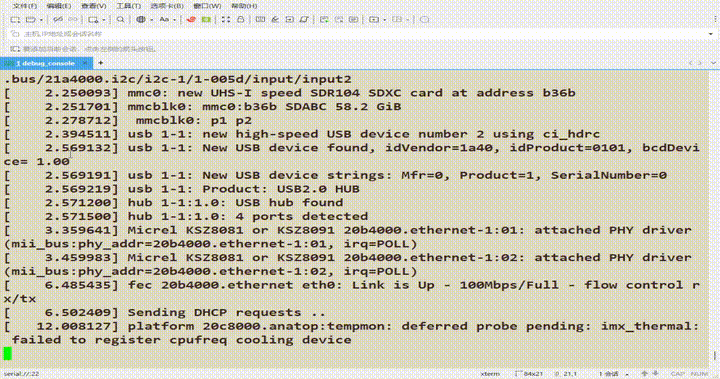

# CFBox

**[中文](README.md)** | [English](README.en.md)

用现代 C++23 实现的 BusyBox 替代品 —— 单二进制、123 applet、399 测试。可在 i.MX6ULL 上作为 PID 1 运行,替代 BusyBox。

<p align="center">
  
</p>

> 上图:cfbox 作为 PID 1 启动 imx-forge rootfs —— 跑 `rcS`(mount/mdev),打印 `Please press Enter to activate this console.`(askfirst),回车进入 cfbox `sh`。

[](https://github.com/Awesome-Embedded-Learning-Studio/CFBox/actions/workflows/ci.yml)
[](https://opensource.org/licenses/MIT)
[](https://en.cppreference.com/w/cpp/23)
[](https://cmake.org/)
[](tests/)
[](src/applets/)
[](cmake/toolchain/Toolchain-armhf.cmake)

## 这是什么？

CFBox 是一个单一可执行文件的 Unix 工具集,通过符号链接分发。**123 个 applet** 已实现并通过测试,CI 流水线覆盖原生构建、交叉编译(armhf/aarch64)、QEMU 用户/系统模式测试。支持 CMake 配置化构建(per-applet 开关)、GNU 风格长选项、彩色帮助输出。并且希望在后续，可以慢慢追赶甚至超越常见的 coreutils。

**设计理念:** 简洁优先 — 现代 C++(`std::expected`,无异常/无 RTTI)— 嵌入式友好(交叉编译、静态链接、当 PID 1 init)。

## 实测:i.MX6ULL

cfbox 在 NXP i.MX6ULL(armhf,Cortex-A7)上**替代 BusyBox**,作为 [imx-forge](projects/imx-forge-demo) rootfs 的 PID 1 + 工具集,撑起完整启动闭环:

| 启动阶段 | cfbox 承担 |
|---------|-----------|
| PID 1 | `init` —— 解析 busybox 格式 `/etc/inittab`,支持 `sysinit`/`askfirst`/`respawn`/`ctrlaltdel`/`shutdown` |
| rcS | `mount -a` / `mount -t devpts devpts /dev/pts` / `mdev -s`(冷启动扫 /sys 建 /dev 节点) |
| console | `askfirst` → `Please press Enter to activate this console.` → 回车 → cfbox `sh` |
| 关机 | `umount -a -r` / `swapoff -a` / `reboot` |

<p align="center">
  
</p>

实测:`/proc/cpuinfo` 显示 `ARMv7 Processor rev 5 (v7l)`(i.MX6ULL),cfbox `sh` 交互,`ls`/`cat`/`df`/`ps`/`uname`/`free` 等正常 dispatch。

<p align="center">
  
</p>

> armhf 静态构建(自包含,直接当 PID 1 跑):
> ```bash
> cmake -B build-armhf-static \
>   -DCMAKE_TOOLCHAIN_FILE=cmake/toolchain/Toolchain-armhf.cmake \
>   -DCMAKE_BUILD_TYPE=Release \
>   -DCFBOX_OPTIMIZE_FOR_SIZE=ON \
>   -DCFBOX_STATIC_LINK=ON
> cmake --build build-armhf-static -j$(nproc)   # 产物 ~1.2 MB
> ```

## 体积对比

我们简单地统计了一下，以下表格由项目内的 `scripts/gen_size_table.sh` 自动生成。

| 项目 | 语言 | 体积 | Applets | 体积/Applet |
|------|------|------|---------|-------------|
| **CFBox (size-opt)** | **C++23** | **418 KB** | **123** | **~3.4 KB** |
| CFBox (armhf static) | C++23 | ~1.2 MB | 123 | — |
| Toybox | C | ~500 KB | 238 | ~2.1 KB |
| BusyBox (full) | C | ~1.7 MB | 274 | ~9 KB |
| uutils/coreutils | Rust | ~11 MB | ~100 | ~110 KB |

> CFBox 比 BusyBox 小 **3-4x**,在相似体积下提供了完整 awk 解释器、归档工具集(tar/cpio/ar/unzip/gzip)、diff/patch(Myers O(ND) 算法)、进程工具集(ps/top/pstree/pgrep/pmap)以及内置 TUI 框架。

## 性能

我们仍然在尝试使用 C++ 逼近主流 box 工具(BusyBox/Toybox)的性能。

| 操作 | 数据规模 | 耗时 |
|------|---------|------|
| grep -c | 10 MB | 54 ms |
| cat | 10 MB | 63 ms |
| wc | 10 MB | 17 ms |
| sort | 100K 行 | 32 ms |
| diff | 100K 行(相似文件) | 79 ms |

- grep/cat/wc 均为流式处理,读取 `/dev/urandom` 不会内存爆炸
- diff 使用 Myers O(ND) 算法,sort 预计算排序 key 避免重复分配
- 零外部依赖:手写轻量 deflate/inflate 替代 zlib

## 快速开始

```bash
# 构建
cmake -B build
cmake --build build

# 测试
ctest --test-dir build --output-on-failure   # 399 个 GTest 单元测试
bash tests/integration/run_all.sh            # 54 套集成测试脚本

# 通过子命令运行
./build/cfbox echo "Hello, World!"

# 或安装符号链接
./scripts/gen_links.sh /usr/local/bin
echo "Hello, World!"   # 通过符号链接调用 cfbox
```

## 支持的命令(123 个)

### 文本处理(31 个)

`echo`, `printf`, `cat`, `head`, `tail`, `wc`, `sort`, `uniq`, `grep`, `sed`, `fold`, `expand`, `cut`, `paste`, `nl`, `comm`, `tr`, `tac`, `rev`, `shuf`, `factor`, `od`, `split`, `seq`, `tsort`, `expr`, `awk`, `diff`, `patch`, `cmp`, `ed`

### 文件操作(22 个)

`mkdir`, `rm`, `cp`, `mv`, `ls`, `find`, `ln`, `touch`, `stat`, `install`, `mktemp`, `truncate`, `du`, `df`, `readlink`, `realpath`, `rmdir`, `link`, `unlink`, `chmod`, `chown`, `chgrp`

### 归档与压缩(6 个)

`tar`(ustar 格式), `cpio`(newc 格式), `ar`(静态库), `unzip`, `gzip`, `gunzip`

### Shell 与脚本(2 个)

`sh`(POSIX shell:管道、重定向、变量展开、命令替换、if/while/for、15 个内置命令), `xargs`

### 系统信息(21 个)

`pwd`, `basename`, `dirname`, `uname`, `hostname`, `whoami`, `id`, `tty`, `date`, `nproc`, `logname`, `hostid`, `printenv`, `env`, `uptime`, `free`, `cal`, `dmesg`, `who`, `test`, `[`

### 进程管理(16 个)

`ps`, `top`, `kill`, `pgrep`/`pkill`, `pidof`, `pstree`, `pmap`, `fuser`, `pwdx`, `sysctl`, `iostat`, `watch`, `nice`, `renice`, `timeout`

### 文件系统与系统启动(12 个)

`mount`(-a/-t/-o,读 fstab), `umount`(-a/-r/-f), `mdev`(-s 冷启动扫描), `mountpoint`, `init`(PID 1,解析 inittab + askfirst), `reboot`, `poweroff`, `swapoff`, `sync`, `mkfifo`, `mknod`, `clear`

### 其他(13 个)

`true`, `false`, `yes`, `sleep`, `usleep`, `nohup`, `cksum`, `md5sum`, `sum`, `hexdump`, `more`, `tee`, `which`

> 所有 applet 均支持 `--help` / `--version`

## 系统要求

- **编译器:** GCC 13+ / Clang 17+(需 C++23 支持)
- **CMake:** 3.26+
- **平台:** Linux(x86_64 / aarch64 / **armhf**,支持静态链接当 PID 1 init)

## 文档

| 文档 | 说明 |
|------|------|
| [架构与设计](document/architecture.md) | 分发机制、核心基础设施、错误处理、测试体系 |
| [生产化升级路线图](document/todo/README.md) | Phase 4.5 到 v1.0 的生产化治理文档集、优先级、发布标准 |
| [交叉编译与嵌入式](document/cross-compilation.md) | 工具链、CMake 选项、构建示例、二进制大小对比 |
| [QEMU 测试](document/qemu-testing.md) | 用户模式 / 系统模式测试、init applet、内核配置 |
| [持续集成](document/ci.md) | CI 流水线阶段说明 |
| [贡献指南](CONTRIBUTING.md) | 构建、测试、编码规范、提交方式 |

## 下一步计划

当前版本 v0.3.0。**Phase 1.5 代码质量审查 + L2 rootfs 启动骨架已完成**(cfbox 已上 i.MX6ULL),进入 Phase 2 核心命令深化:

### 已完成:L2 rootfs 启动骨架(✅ 端到端验证)

补齐 cfbox 替代 BusyBox 当 PID 1 的全部缺口:`init`(askfirst)、`mount`、`mdev`、`umount`、`swapoff`、`reboot`/`poweroff` —— 在 i.MX6ULL + imx-forge rootfs 实测启动到 console。

### Phase 2:核心命令深化(进行中)

将现有命令功能深度提升,按运维频率分批推进:

| 批次 | 命令 | 关键补充 |
|------|------|---------|
| 第一批 | `tail`、`cp`、`test`、`ls` | tail -f、cp -a、全面 POSIX test、ls -R/--color |
| 第二批 | `grep`、`tar`、`sed`、`sort` | grep -A/-B/-C、tar -z/-v、sed -i、sort -k |
| 第三批 | `find`、`sh`、`ps`、`df`、`du` | find 布尔表达式、sh case/heredoc/函数/行编辑 |

> 详细路线图见 [document/todo/README.md](document/todo/README.md)。

## 贡献

见 [CONTRIBUTING.md](CONTRIBUTING.md)。

## 许可证

MIT 许可证 — 详见 [LICENSE](LICENSE)。
