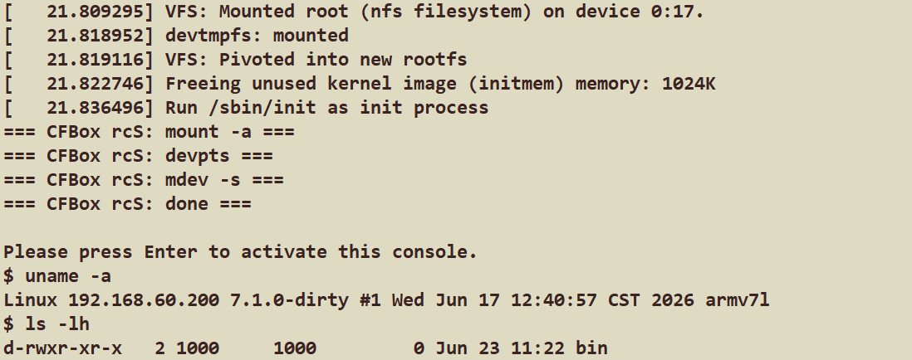

# 一个月后的CFBox：CFBox v0.3.0发布，从QEMU的玩具走上了i.MX6ULL的真机启动

> 一个用现代 C++23 重写的 BusyBox 替代品。单二进制、零运行时依赖、能当 PID 1。
> 从 v0.1.0 到 v0.3.0，它从一个「概念验证」长成了「能在真实硬件上开始尝试替代 BusyBox 的工具集」。

---

## TL;DR

CFBox 用 C++23（`std::expected`、禁异常/RTTI、手写 deflate 替代 zlib）把 BusyBox 那套核心命令重做了一遍，编译出来**一个 418 KB 的单文件**，通过符号链接分发 123 个命令。v0.3.0 这次，我们让它**真的在 NXP i.MX6ULL 板子上当 PID 1，替代了 BusyBox**。

---

## v0.1.0 → v0.3.0，发生了什么

v0.2.0是一次小更新，所以的话我们跟v0.1.0的比。

先把两张牌亮在桌面上，所有数字都是我从仓库里现扒的——注册表条目数、`ctest` 实跑、size-opt strip 之后的体积，不是拍脑袋：

| 指标 | v0.1.0 | v0.3.0 | 变化 |
|------|:------:|:------:|------|
| Applet 数 | 109 | **123** | +14 |
| GTest 单元测试 | 331 | **399** | +68 |
| size-opt 二进制 | 446 KB | **418 KB** | **−28 KB（−6.3%）** |
| 每 applet 均摊 | ~4.1 KB | **~3.4 KB** | 更省 |
| PID 1 验证 | QEMU aarch64 演示 | **i.MX6ULL 真机端到端** | 质变 |
| armhf 静态构建 | — | **~1.2 MB（自包含，直跑当 PID 1）** | 新增 |

你大概率会先盯上第三行——命令多了 14 个，测试多了 68 个，二进制反而瘦了 28 KB。说实话这不太符合直觉，通常加功能就是往大了长，加着加着就膨胀了。但这回我们反着走，靠的不是砍东西，是 v0.2.0 那阵子把 C++ 这些年欠下的「隐性体积税」给补交了。这个事单独拎出来讲。

---

## 命令多了，二进制反而瘦了

先把最显眼的一个拎出来：iostream。这玩意儿在 C++ 二进制里是出了名的体积大头，但凡你 `#include` 过一次 `<iostream>`，链接器就给你拽进来一大坨 locale、缓冲、格式化的运行时。v0.2.0 那轮我们下了狠手，把它整个家族——`<fstream>`、`<sstream>`、`<iostream>`——全量干掉，一个 fstream 符号都不留，文件读写全换回 `<cstdio>` 的 `FILE*` 配 `fgets` / `fprintf`。光这一刀，体积就松了一大截。

再一个是 `std::stoi`。这东西在 `-fno-exceptions` 底下藏着一个特别阴的坑：字符串解析失败的时候，它不给你返回错误码，而是直接 `abort()` 把整个进程干掉。放在一个普通工具里顶多是难用，但 CFBox 是要当 PID 1 的——init 进程被一个非法数字直接带走，那场面不要太刺激。所以全量换成 `std::strtol` 配 errno，雷拆了，异常运行时那一份开销也顺手省了。

剩下还有两块收尾的活。一块是把 100 多个 applet 各写各的 `fprintf(stderr, "cfbox xxx: ...")` 收敛到一个 `CFBOX_ERR` 宏，去重了一堆重复的格式化代码；另一块是给 `fs_util` 补上 `chown` / `lchown` / `for_each_entry()`，让 chmod、chown、chgrp 这几个不再各自把递归遍历重写一遍。

你会发现，这几件事没一件是「加功能」，全是把之前随手写的、能跑就行的那部分拧紧。但加起来的效果就是这么直白：命令越加越多，二进制反倒越来越小。这也是我们敢拿一个 C++ 项目，去和纯 C 的 BusyBox 掰体积的底气所在。

---

## 从 QEMU 里跑，到 i.MX6ULL 上板当 PID 1

这大概是 v0.3.0 花力气最多的一块，也是整个版本真正想交付的东西。

我们回头看 v0.1.0，`init` 这个 applet 其实早就有了，但老实说它当时更像一个「演示」——只在 QEMU aarch64 里把启动流程跑过一遍，本质上还是模拟器里的玩具。你真要把它搁到一块板子上、让它从上电那一刻起就作为 PID 1 把整个用户态管起来，中间差的那段路，远比「写一个能解析 inittab 的 init」要长得多。这一次，我们把这段路走通了：在 NXP i.MX6ULL（Cortex-A7，armhf）上，CFBox 作为 [imx-forge](../projects/imx-forge-demo) rootfs 的 PID 1 和工具集，撑起了完整一条启动闭环，实打实替代了 BusyBox。

为了把这条链路补全，我们新增了六个 applet，正好一个萝卜一个坑，卡在启动链的每个缺口上：

| 启动阶段 | CFBox 承担 |
|---------|-----------|
| PID 1 | `init` —— 解析 busybox 格式 `/etc/inittab`，支持 `sysinit` / `askfirst` / `respawn` / `ctrlaltdel` / `shutdown` |
| rcS | `mount -a` / `mount -t devpts devpts /dev/pts` / `mdev -s`（冷启动扫 `/sys` 建 `/dev` 节点） |
| console | `askfirst` → 打印 `Please press Enter to activate this console.` → 回车 → 进 CFBox `sh` |
| 关机 | `umount -a -r` / `swapoff -a` / `reboot` |

新加进来的这六个分别是：`mount`（`-a`/`-t`/`-o`，会读 fstab）、`mdev`（`-s` 冷启动扫描，照 `/sys` 给 `/dev` 补节点）、`umount`（`-a`/`-r`/`-f`）、`swapoff`，以及 `reboot` 和 `poweroff`。

启动起来之后的验证，是真的在板子上敲的那种，不是跑分：

- `/proc/cpuinfo` 老老实实打印出 `ARMv7 Processor rev 5 (v7l)`，确认这玩意儿确实跑在 i.MX6ULL 上
- 回车进 CFBox 自己的 `sh`，`ls` / `cat` / `df` / `ps` / `uname` / `free` 全部正常 dispatch，没一个是 BusyBox 在背后代劳
- 从上电、rcS、askfirst 拉起 console，一直到关机那一下的 `umount -a -r` / `swapoff -a` / `reboot`，整条链路里 BusyBox 一次都没有介入



事情到这里，CFBox 才算从「一个挺能打的练手项目」迈过了「能塞进真实嵌入式系统当组件用」那道坎。

---

## CFBox 到底想证明什么

说句心里话，CFBox 一直想验证的就一件事：用现代 C++，也能写出和 BusyBox 一样小、一样快、搞不好还更安全一点的 box。

手段其实都很笨、很基础，但每一条都是实打实省开销的。我们全局禁了异常和 RTTI（`-fno-exceptions -fno-rtti`），错误全部走 `cfbox::base::Result<T>`（就是 `std::expected`）配 `CFBOX_TRY`，没有异常运行时那一坨零额外成本；对外零运行时依赖，压缩这边自己手写了一套轻量 deflate/inflate 把 zlib 替了，单文件静态链接就能扔出去。

性能这边也跑了一下，不是 PPT 上的数：

| 操作 | 数据规模 | 耗时 |
|------|---------|------|
| `grep -c` | 10 MB | 54 ms |
| `cat` | 10 MB | 63 ms |
| `wc` | 10 MB | 17 ms |
| `sort` | 100K 行 | 32 ms |
| `diff` | 100K 行（相似文件） | 79 ms |

这里头 grep、cat、wc 全是流式处理，喂 `/dev/urandom` 这种无限流不会内存爆炸；diff 用的是 Myers O(ND) 算法；grep 和 sed 用 POSIX 的 `regex_t` 顶掉了又慢又重的 `std::regex`；sort 则是预计算好排序 key，避免比较器里反复分配。工程纪律这块也不想糊弄：399 个 GTest 加 54 套集成脚本全绿，ASan 零泄漏，编译零 warning（`-Werror` 顶着），CI 覆盖原生构建、armhf / aarch64 交叉编译，以及 QEMU 的用户模式和系统模式。

---

## 拉个坐标看看自己站在哪

| 项目 | 语言 | 体积 | Applets | 体积/Applet |
|------|------|------|---------|-------------|
| **CFBox (size-opt)** | **C++23** | **418 KB** | **123** | **~3.4 KB** |
| Toybox | C | ~500 KB | 238 | ~2.1 KB |
| BusyBox (full) | C | ~1.7 MB | 274 | ~9 KB |
| uutils/coreutils | Rust | ~11 MB | ~100 | ~110 KB |

CFBox 比 BusyBox 小 3 到 4 倍，而且在差不多这个体积下，该有的东西一样没落下：一个完整的 awk 解释器、一整套归档工具（tar/cpio/ar/unzip/gzip）、diff/patch、一整套进程工具（ps/top/pstree/pgrep/pmap），外加一个内置的 TUI 框架。

---

## 顺手填的几个坑

除了启动这条主线，v0.3.0 还顺手收拾了几个让 CFBox 在真终端上能正常用的坑。

一个是 `tail -f`。说真的，一个 box 要是没有 follow 模式，看日志基本没法用，v0.1.0 那会儿这功能是缺的。这次补的是 fd-based 的 follow：`fstat` 轮询配 64 KiB 的 quantum，`-F` 带一个 drain-switch 应对日志轮转，收到 SIGINT 就干净退出，而不是甩一个错误码出来恶心你。

另一个坑就特别有画面感了：串口控制台上，退格键按了不擦字。你想想，在串口终端上一个字一个字敲命令，敲错了一个退不掉，那血压直接拉满。根因其实不复杂，是 termios 里那个 `VERASE` 没设对，默认值不是 Ctrl-H，所以在串口上根本触发不了擦除。设成 `VERASE=Ctrl-H` 就好了。顺带把 cooked tty、默认 PATH、`ls -l` 的 owner/group 显示这几样也一起修了。

---

## 想自己跑一下的话

```bash
# 原生构建 + 测试
cmake -B build && cmake --build build
ctest --test-dir build --output-on-failure   # 399 个单元测试
./build/cfbox echo "Hello, World!"

# armhf 静态构建（自包含，可以直接当 PID 1 跑）
cmake -B build-armhf-static \
  -DCMAKE_TOOLCHAIN_FILE=cmake/toolchain/Toolchain-armhf.cmake \
  -DCMAKE_BUILD_TYPE=Release \
  -DCFBOX_OPTIMIZE_FOR_SIZE=ON \
  -DCFBOX_STATIC_LINK=ON
cmake --build build-armhf-static -j$(nproc)   # 产物 ~1.2 MB
```

GitHub：<https://github.com/Awesome-Embedded-Learning-Studio/CFBox>，License 是 MIT。

---

## 接下来干嘛

v0.3.0 把「能当 PID 1」这条路打通了，接下来我们回到 Phase 2 的核心命令深化：`cp -a` 归档模式、全面的 POSIX `test`、`ls -R` 和 `--color`、`grep -A/-B/-C`、`find` 的布尔表达式、`sh` 的 case / heredoc / 函数。再往后就是 Phase 3 的网络最小闭环了。

我们的思路一直没变：不靠堆 applet 数量凑数，而是按真实运维频率，把那些高频命令的功能深度一点点做到位——场景闭环优先于数量。

---

走到真机上这一版，可以庆祝一下了。CFBox 是个会长期长下去的事情，欢迎来 GitHub 提 issue、提 PR，哪怕只是来聊聊「C++ 到底能不能写好一个 box」也行。完结撒花。
